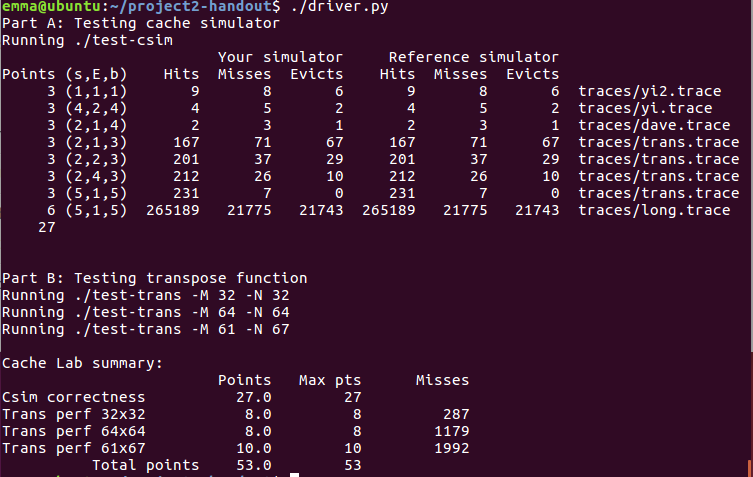

# CS359-Project-2-Understanding-Cache-Memories

The lab consists of two parts, part A and part B. In the part A, there is a small C program that simulates the behavior of a cache memory. In the part B, a matrix transpose function is optimized to minimize the number of cache misses. The two part will help us to understand the impact that cache memories can have on the performance of a program. Detailed descriptions can be find in [Guide](./Guide.pdf 'Guide.pdf')

## Part A 
### Analysis
Some key points are listed as follows. 
* Cache structure and realization 
According to input s, E, and b, our cache consists of 2s sets and each set consists of E lines which contain detailed information of a block. Given that we just simulate the behavior of a cache, we don’t need to store real block content. Thus, for each line, we use structure only to record its tag, valid bit, and age(LRUtime). In order to adapt to different inputs, we use function calloc() to dynamic allocate storage and initialize it to 0. 

* Get command-line arguments Use getopt() function.

* Read from file Use fscanf() function. 
”I” operation and block size are useless, just omit them. Use unsigned 64 int to store hexadecimal address and calculate tag. Actually, there is only one operation, accessing cache. ”M” is ”L” followed by ”S”. ”L” and ”S” are the same. • Detect hit/miss/eviction Check valid bit and tag in cache to determine whether it’s a hit. If not, find the oldest block(block with min LRUtime). Determine whether it’s a valid block or eviction via valid bit. 

* LRU realization 
Initialize global clock to 0 and increase it every time we check a cache access. Assign the current clock to the block latest accessed.

### Code
See code/csim.c

## Part B

### Analysis
We use a direct-mapped cache with parameters (s = 5, E = 1, b = 5) to do matrix transposition, so there are 32 blocks in cache and 32 bytes in each block. Given that a integer is 4 byte, there are 8 integers in each block. In order to decrease the number of conflict misses, we can divide the matrix into sub-matrixes.

* 32×32 matrix 
Given that a block contains 8 bytes, we can divide the matrix into 8×8 sub-matrixes. Thus, all the blocks can be found in cache when transposing two sub-matrixes. But if we use the naive division, the number of miss is greater than 300. Through further analysis of the results, we can find that the extra misses come from elements in the diagonal. Along the diagonal, the elements of two sub-matrixes conflict.  To reduce this miss, We can use 8 variables to store the elements of the block and then copy to another.
* 64×64 matrix 
For 64×64 matrix A,each row contains 8 blocks, which means elements in the same column will conflict every 4 rows. Thus, if we still use  8×8 sub-matrixes, elements will conflict even in the same sub-matrix. We can divide the matrix into 4×4 sub-matrixes to avoid inside conflicts, but unfortunately, the number of miss is greater that 1300. Final solution is to divide the matrix into 8×8 sub-matrixes and further divide 8×8 sub-matrix into 4 4×4 sub-matrixes called A1(A[1−4][1− 4]), A2(A[1−4][5−8]), A3(A[5−8][1−4]), and A4(A[5−8][5−8]). First, we move A1, A2 to B1, B2. Then, we move B2 to B3 and move A3 to B2. Finally, we move A4 to B4. In this way, we can avoid conflicts inside 8×8 sub-matrixes and conflicts alongthe diagonal. Duringeach movement of 4×4 sub-matrix, we use 4 temporal variables to store a half block in order to reduce misses. 

* 61×67 matrix 
For 61×67 matrix, it’s hard to handle like 32×32 matrix and 64×64 matrix, because the number of element in a row or column isn’t a multiple of 8. However, the required number of miss is 2000, which is much looser, so we can try different division strategies. Ihavetried 4×4 sub-matrix, 8×8 sub-matrix, and 16×16 sub-matrix. The result of 16×16 sub-matrix is less than 2000. The results of other two strategies are greater than 2000.

### Code
See code/trans.c

## Result

Put it all together by driver.py, and we get the final result, 53 points, which is the best points we can get for part A and part B.

